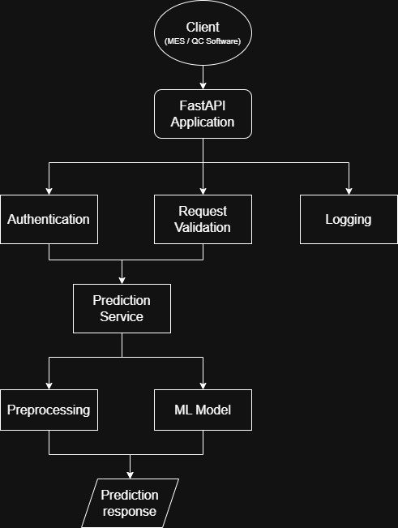

## Table of Contents

- [Business Problem](#business-problem)
- [Goal](#goal)
- [Project Status](#project-status)
- [Dataset](#dataset)
- [Software Requirements Specification](#software-requirements-specification-srs)
- [Architecture and  Repository Structure](#architecture-and-repository-structure)
- [Exploratory Data Analysis](#exploratory-data-analysis)
- [Preprocessing](#preprocessing)
- [Baseline Model](#baseline-model)
- [Experiment Tracking](#experiment-tracking)
- [Future Improvements](#future-improvements)

## Business Problem

Predict the defect category of a manufactured steel plate using production measurements.

## Goal

 Develop a production-ready ML classification API capable of predicting one of seven defect categories.


## Project Status

### Completed

- [x] Software Requirements Specification (SRS)
- [x] Repository structure
- [x] Exploratory Data Analysis
- [x] Preprocessing pipeline
- [x] Unit tests
- [x] Baseline Logistic Regression model
- [x] Model evaluation
- [x] MLflow experiment tracking

## Quick Start

Clone the repository

```bash
git clone ...
```

Create environment 

```bash
python -m venev .venv
```
Activate
```
...
```
Install
```
pip install -r requirements.txt
```

Train
```
python -m training.train
```
Launch MLflow
```
mlflow ui
```


## Dataset


This project uses the **Steel Plates Faults** dataset from the UCI Machine Learning Repository.

The dataset description, feature definitions, and exploratory analysis can be found in:

- [`data/README.md`](data/README.md)

## Software Requirements Specification (SRS)

Initial requirements definition with the following list of sections can be found in  [`docs/SRS.md`](docs/SRS.md)

- Business Problem
- Business value

- API Consumer
- System overview
- Stakeholders
- Functional requirenments
- Open Questions

- In Scope (Version 1)
- Out of Scope (Version 1)
- Non-Functional requirements
- Assumptions
- Constraints


## Architecture and Repository Structure

The project follows a modular architecture separating:

- Data loading
- Preprocessing
- Model training
- Evaluation
- Inference

A Architecture and repository are vailable in: [`docs/Architecture.md`](docs/Architecture.md)

Design decisions (ADRs), Risk register, and diagrams are available in:

- [`docs/adr`](docs/adr)
- [`docs/Risk_Register`](docs/Risk_Register.md)
- [`docs/diagrams`](docs/diagrams)


## Exploratory Data Analysis

The dataset has been analyzed to understand:

- Class distribution
- Missing values
- Feature distributions
- Outliers
- Feature correlations

Main findings:

- No missing values
- Imbalanced target classes
- Numerical features with different scales
- Several outliers retained for the baseline model

Full EDA report can be found in: [`docs/Eda_Report.md`](docs/Eda_Report.md)

## Preprocessing

Current preprocessing pipeline:

- StandardScaler for numerical features
- Binary features passed through unchanged
- Scikit-learn ColumnTransformer
- Unit tested with pytest

Full preprocessing documentatioon can be found in [`docs/Preprocessing.md`](docs/Preprocessing.md)

## Baseline Model

Current baseline:

- Logistic Regression
- Stratified train/test split
- StandardScaler preprocessing
- Evaluation metrics:
  - Accuracy
  - Precision
  - Recall
  - Macro F1
- Classification report
- Confusion matrix

Full baseline model documentation can be found in [`docs/baseline_model_design.md`](docs/baseline_model_design.md) 

### Results 

Baseline Logistic Regression

| Metric | Value |
|---------|------:|
| Accuracy | 0.72 |
| Macro Precision | 0.76 |
| Macro Recall | 0.73 |
| Macro F1 | 0.74 |

The result documentation can be found in [`docs/Results.md`](docs/Results.md)

## Experiment Tracking

Experiments are tracked using MLflow.

Each training run records:

- Training parameters
- Evaluation metrics
- Confusion matrix
- Trained model
- Preprocessor


## Future Improvements

- [ ] Random Forest baseline
- [ ] Hyperparameter tuning
- [ ] FastAPI inference API
- [ ] Docker deployment
- [ ] CI/CD with GitHub Actions