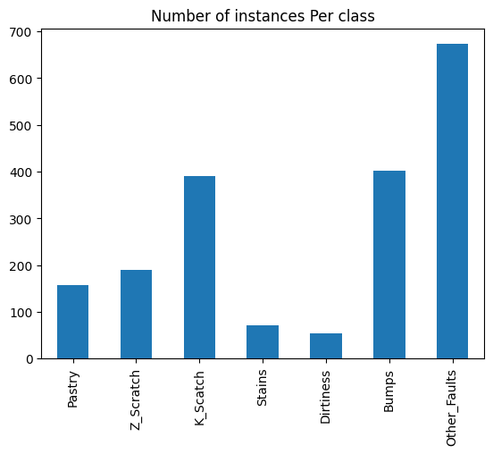
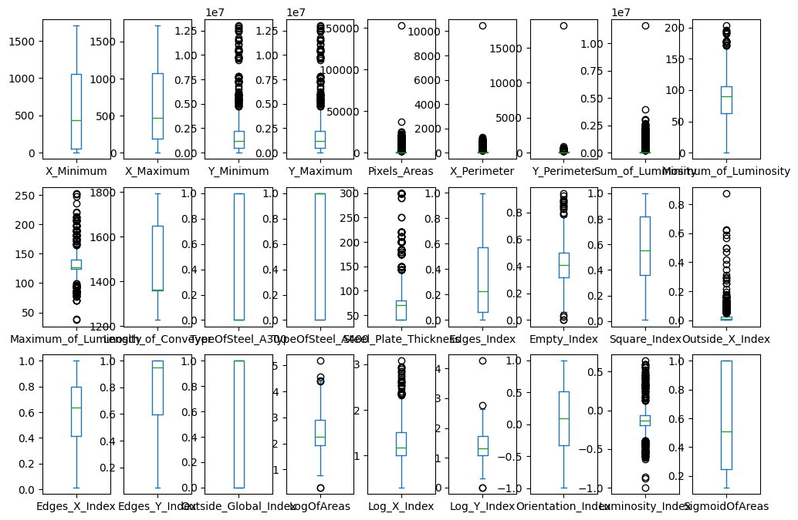
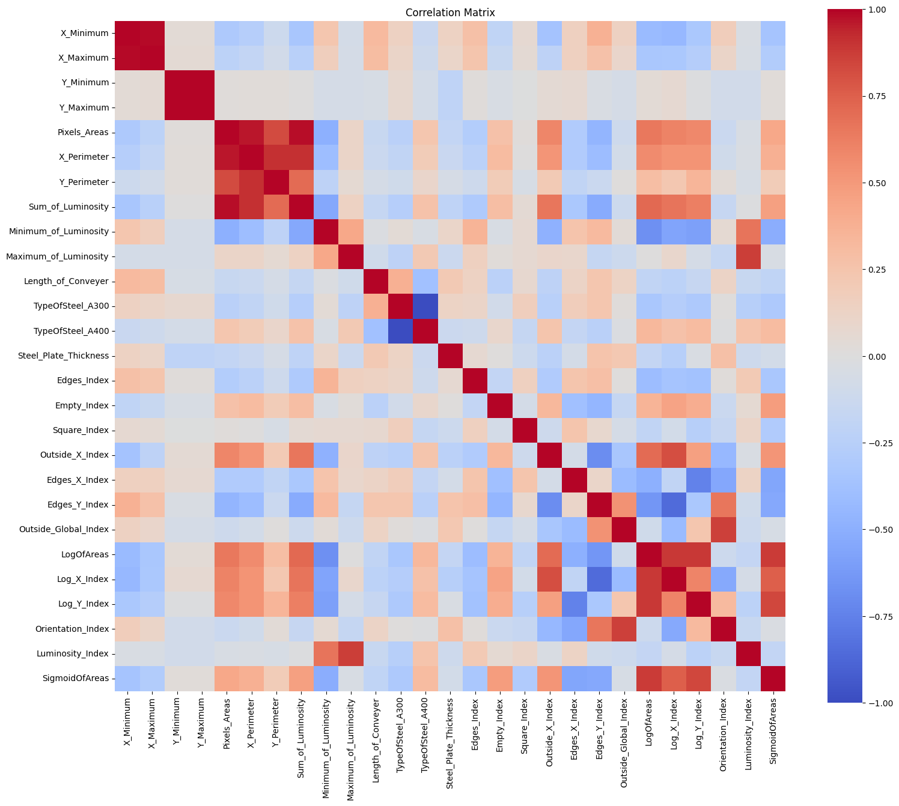

# Exploratory Data Analysis

## 1. Objective

Explorate the dataset and extract all the elemental characteristics of the features and the classes to take preprocessing decisions. 

Notebook with the full process used for the data exploration

> training\eda.ipynb 

## 2. Dataset overview

- Samples: 1941
- Features: 27
- Target: 7 classes
- Units: Non defined by the source
- Features meaning: Non defined by the source
## 3. Data Quality Assesssment

### Questions to solve

- Are all features numeric? 
- Are there strings?
- Missing values?
- Data types?
- Scaling is needed?
- Cols with Negative Values?
- Any Constant column?

### Data features information

#### memory usage 
409.6 KB

#### dtypes
- features(0-13): int64
- features(14-26): float64

#### non-null
- features(0-26): 1941

#### Conclusion
- There are no string variables. 
- There are no null values, therefore "imputation" process is not needed.

### Scale revision of data

#### Description

Features descriptors show a significant variability among them.

**Example**  

feature  2(Y_Minimum): mean= 1.650685e+06 , std= 1.774578e+06 \
feature 25(Luminosity_Index): mean= -0.131305    , std= 0.148767 

#### Conclusion

Large differences between their means and std's values. A scaling process is needed.

### Duplicates 
0 instances duplicated
### Null values:
0

### Conclusion

All the instances are uniques, and all their values are non-null. Therefore, depuration is not needed.  

### Features with Negative Values:

- **24**: Orientation_Index
- **25**: Luminosity_Index

### Features with constant value:
0

### Conlusion
- Only two variables have negative values. 
- The dataset does not contain features with a constant value.
- An analysis of the physical limits of the features is required to detect errors in the values.

## 4. Target Variable Analysis

### Questions to solve

- How many classes?
- Balanced or Imbalanced?
- Rare classes? 

### Data target information:

#### memory usage 
106.3 KB

#### dtypes
- targets(0-6): int64

#### non-null
- targets(0-6): 1941

### Conclusion
The target is composed of 7 classes. The classes have a binary value. For each instance, only one of the classes has a positive value (1), while the others have a negative value (0).

### Classes Balance

Figure Classes distribution shows the histogram of classes with their number of instances:    

    

### Description 
A clear difference is observed in the number of instances per class, where the largest class contains approximately twelve times more samples than the smallest.

#### Example

- Dirtiness : 55
- Other_Faults : 673

### Conclusion

The dataset is imbalanced

## 5. Feature analysis

For each feature determine:

- How is it distributed?
- Normal?
- Skewed?
- Outliers?

### Strategy

- Graph the boxplot for each feature. 
- Get the skewness value for each instance
- Check the root of outliers to have a closer conclusion. 

Figure Boxplots shows the boxplots of each feature.   

    
### Skewness
#### Result
Several features resulted in a high value of skewness > abs(0.5). Being the highest with a value of 39.293158. 

#### Conclusion
Several continuous variables exhibit moderate to high skewness. Because the baseline model has not yet been selected, no transformations will be applied during EDA. Distribution transformations and feature scaling will be evaluated during preprocessing depending on the selected algorithm.

### Outliers

#### Results
The boxplot graphs depict the existency of outliers

#### Conclusion

Despite the boxplot graphs depict the existency of outliers based on "Tukey outlier rule":  values > 1.5*IQ. They could be potential characteristics of defective steel plates rather than obvious data quality issues.

In the boxplots we can observe one isolated element in 4 of the features: Pixels_Areas, X_Perimeter, Y_Perimeter, and Sum_of_Luminosity. In order to see if they belong to the same instance we get the index of the highest values.

### Potential outliers:

### Notes
Instance 390 represents an extreme observation according to the IQR criterion. Its values represent the highest value for 8 of the features. 

Class = "K_scatch"

Instance 621 represents an extreme observation according to the IQR criterion. Its values represent the lowest value for 8 of the features. 

Class = "K_scatch"

### Feature Analysis Summary

- The dataset contains three binary features that will be retained without transformation.
- Most continuous features show varying numerical ranges, indicating that feature scaling may be required for algorithms sensitive to feature magnitude.
- Approximately fifteen features contain observations beyond the interquartile range. These values are considered potential characteristics of defective steel plates rather than obvious data quality issues, so no outlier removal is proposed at this stage.
- Two instances require a deeper revision to evaluate if they are or are not outliers.
- Several continuous features exhibit skewed distributions. Distribution transformations will be considered during preprocessing if required by the selected baseline model.
    

## 6. Correlation Analysis

### Objective

Answer questions such as:

- Are some features highly correlated?
- Are there redundant features?
- Should we consider feature selection later?
- Is there evidence of multicollinearity?

Figure Correlation Matrix shows the correlation matrix of the 27 features.    

    
### Results

- 13 pairs exhibit strong positive correlations (|r| > 0.85), where 2 pairs even resulted in (|r| == 1)

#### Examples
- TypeOfSteel_A300       TypeOfSteel_A400         1.000000
- Y_Minimum              Y_Maximum                1.000000
- X_Minimum              X_Maximum                0.988311
- Pixels_Areas           Sum_of_Luminosity        0.978951

### Conclusion 

- A Pearson correlation analysis was performed to evaluate linear relationships among the numerical features. Although most feature pairs exhibit weak to moderate correlations, several groups of features (13) exhibit strong positive correlations (|r| > 0.85) where 2 pairs even resulted in (|r| == 1), suggesting that multiple measurements may capture similar physical characteristics of the steel plates. Feature selection techniques or dimensionality reduction methods may be evaluated during model development.

## 7. Engineering Decisions

- No missing-value imputation is required.
- Duplicate removal is not required.
- Binary features will remain unchanged.
- Outliers will be retained for the baseline model to avoid removing potentially informative defect characteristics.
- The influence of the identified extreme observations on model performance will be evaluated during preprocessing before applying any outlier handling techniques.
- Feature scaling will be evaluated during preprocessing.
- Feature selection is postponed until baseline model evaluation.
- The dataset exhibits class imbalance; therefore, Macro F1-score will be used in addition to Accuracy.