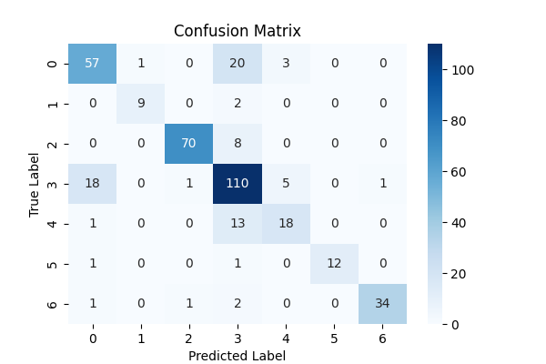

# logistic regression

## Description

Model evaluated as promissing for adding deal with possible non-linearity.

### Library:
sklearn.ensemble.RandomForestClassifier

### Basic hyperparameters:

- random_state=42
- n_estimators=100
- criterion="gini"

## Results

### Classification report: 
| index | failure |       precision  |  recall | f1-score |  support|
|---|--------|-------------------|---------|----------|--------|
| 0 |Bumps    |   0.73    |  0.70  |    0.72  |      81  |
| 1 |Dirtiness |    0.90    |  0.82  |    0.86  |      11  |
| 2 |K_Scatch   |  0.97   |   0.90  |    0.93   |     78  |
| 3 |Other_Faults |      0.71   |   0.81   |   0.76    |   135  |
| 4 |Pastry    |   0.69   |   0.56  |    0.62    |    32  |
| 5 |Stains   |    1.00   |   0.86  |    0.92    |    14  |
| 6 |Z_Scratch   |    0.97   |   0.89  |    0.93    |    38  |
|

#### Global:

**accuracy:**  0.80 

| avg |       precision  |  recall | f1-score |  support|
|--------|-------------------|---------|----------|--------|
|macro    |   0.85   |   0.79   |   0.82   |    389|
|weighted   |    0.81   |   0.80   |   0.80   |    389|

### Confusion matrix

## Conclusion 

The random forest model without hyperaparameters tunning achieved an overall accuracy of 0.80 and a macro F1-score of 0.82, surpassing in both metrics to the reference model.

Performance varied across defect categories. Both K_Scratch, and Z_Scratch (F1 = 0.93), and Stains (F1 = 0.92) were classified with high reliability, suggesting that the available numerical descriptors effectively separate these defect types.

The lowest performance was observed for the Pastry class (F1 = 0.62), followed by Bumps (F1 = 0.72). Analysis of the confusion matrix reveals that both classes are frequently misclassified as Other_Faults. Likewise, samples belonging to Other_Faults are often predicted as Bumps or Pastry, indicating a bidirectional confusion among these three categories.

Altough the results indicate an improving respect to the baseline, still misclassifications occur consistently. Then, tuning of hyperparameters is required.

Class imbalance may contribute to the difficulty, but it does not fully explain it. The confusion between Pastry, Bumps, and Other_Faults is likely also driven by the similarity of their feature distributions. At least one model evaluation is recommended to discard possible defect of this ensemble method.