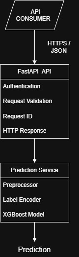

## API consumers

- Manufacturing Execution System (MES)
- Internal QC software
- Other software clients
- Human developers only through Swagger/OpenAPI for testing/documentation

The API is primarily intended for machine-to-machine communication. \
Swagger/OpenAPI is provided as a developer interface for testing and documentation.

## High level Architecture



The API is divided into the following logical components:

- **API layer**: handles HTTP requests, authentication, validation and responses.
- **Prediction service**: coordinates preprocessing, model inference and output transformation.
- **Model artifacts**: persisted XGBoost model, preprocessor, label encoder and metadata.

## 3. Request Flow

1. Consumer sends an authenticated request to `/predict`.
2. FastAPI validates the request schema.
3. The API generates a unique `request_id`.
4. The prediction service preprocesses the input.
5. The trained XGBoost model generates a prediction.
6. The label encoder converts the prediction to the defect class.
7. The API constructs the response.
8. The response includes the prediction, confidence, model version, timestamp and request ID.

## API endpoints

- GET  /health
Used to determine wheter the API is available.
- POST /predict
Used to generate a steel-defect prediction from one sample.

## ``/predict`` request Contract

- The request should contain the 27 model features.

```
For example:

{
    "X_Minimum": 42,
    "X_Maximum": 156,
    "Y_Minimum": 1200,
    ...
}
```
- Feature names must match the defined schema.
- Input types must be validated.
- Unknown or malformed fields should be rejected according to the API schema.

## ``/predict`` Response Contract
```
{
    "request_id": "8f3a...",
    "prediction": "Pastry",
    "confidence": 0.87,
    "model_version": "xgboost-v1.0.0",
    "timestamp": "2026-08-04T22:00:00Z"
}
```
### Response fields

| Field           | Description                                                 |
| --------------- | ----------------------------------------------------------- |
| `request_id`    | Unique identifier for the prediction request                |
| `prediction`    | Predicted steel-defect class                                |
| `confidence`    | Model confidence/probability associated with the prediction |
| `model_version` | Version of the model used for inference                     |
| `timestamp`     | Time at which the prediction was generated                  |

## Error handling

| Situation               | HTTP status |
| ----------------------- | ----------: |
| Valid prediction        |       `200` |
| Invalid request         |       `422` |
| Missing/invalid API key |       `401` |
| Server/model error      |       `500` |

Error responses should use a consistent JSON structure

Example:

````{
    "request_id": "8f3a...",
    "error": "Invalid API key"
}
````
## Authentication

The API uses of API-key authentication.

For example:
```
X-API-Key: <api-key>
```

Requests without a valid API KEY are rejected.

## Model loading strategy

The model artifacts are loaded once when the application starts and kept in memory.

The API should not load the model from disk for every prediction request.

The prediction service uses:

- Preprocessor
- Label encoder
- XGBoost model
- Model metadata

## Artifact dependencies

The API depends on the following artifacts:


````
models/selected/

|-- model_xgboost_1.0.0.joblib
|-- preprocessor.joblib
|-- label_encoding_xgboost_1.0.0.joblib
|-- metadata_xgboost_1.0.0.json
````
## Non-functional requirements

Related to inference API:


### Performance
- Low inference latency.
- Model artifacts loaded once during application startup.
### Reliability
- Deterministic predictions for the same input and model.
- Clear error handling using appropriate HTTP status codes.
### Traceability
- Unique request_id for each prediction.
- Model version included in every prediction response.
### Security
- API-key authentication.
- Invalid credentials must be rejected.
### Maintainability
- Separation between API layer and prediction logic.
- API contract documented through OpenAPI/Swagger.


## API Design Principles
- RESTful HTTP interface.
- JSON request and response format.
- Machine-to-machine communication as the primary use case.
- Stateless prediction requests.
- API layer separated from ML inference logic.