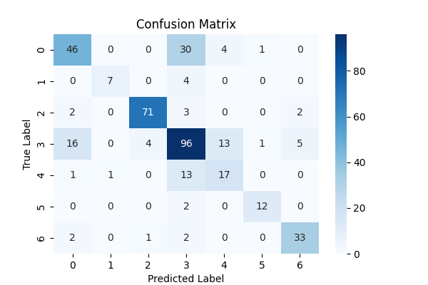

# Baseline model results

## clasiffication report: 
| index | failure |       precision  |  recall | f1-score |  support|
|---|--------|-------------------|---------|----------|--------|
| 0 |Bumps    |   0.69   |   0.57  |    0.62   |     81|
| 1 |Dirtiness |      0.88    |  0.64  |    0.74    |    11|
| 2 |K_Scatch   |    0.93    |  0.91    |  0.92    |    78|
| 3 |Other_Faults |      0.64 |     0.71  |    0.67    |   135|
| 4 |Pastry    |   0.50    |  0.53   |   0.52  |      32|
| 5 |Stains     |  0.86    |  0.86  |    0.86    |    14|
| 6 |Z_Scratch   |    0.82  |    0.87   |   0.85 |       38|
|

### Global:

**accuracy:**  0.72 

| avg |       precision  |  recall | f1-score |  support|
|--------|-------------------|---------|----------|--------|
|macro    |    0.76  |    0.73   |   0.74   |    389|
|weighted   |  0.73   |   0.72   |   0.72   |    389|

## Confusion matrix

## Conclusion 

The baseline Logistic Regression model achieved an overall accuracy of 0.72 and a macro F1-score of 0.74, providing a solid reference for future model comparisons.

Performance varied across defect categories. K_Scratch (F1 = 0.92), Stains (F1 = 0.86), and Z_Scratch (F1 = 0.85) were classified with high reliability, suggesting that the available numerical descriptors effectively separate these defect types.

The lowest performance was observed for the Pastry class (F1 = 0.52), followed by Bumps (F1 = 0.62). Analysis of the confusion matrix reveals that both classes are frequently misclassified as Other_Faults. Likewise, samples belonging to Other_Faults are often predicted as Bumps or Pastry, indicating a bidirectional confusion among these three categories.

Since these misclassifications occur consistently, the results suggest that the current feature space does not provide sufficient linear separability for these defect types. Future work will evaluate more expressive models, such as tree-based ensemble methods, to determine whether nonlinear decision boundaries improve discrimination among these classes.

Class imbalance may contribute to the difficulty, but it does not fully explain it. The confusion between Pastry, Bumps, and Other_Faults is likely also driven by the similarity of their feature distributions or by the limitations of a linear model like Logistic Regression.